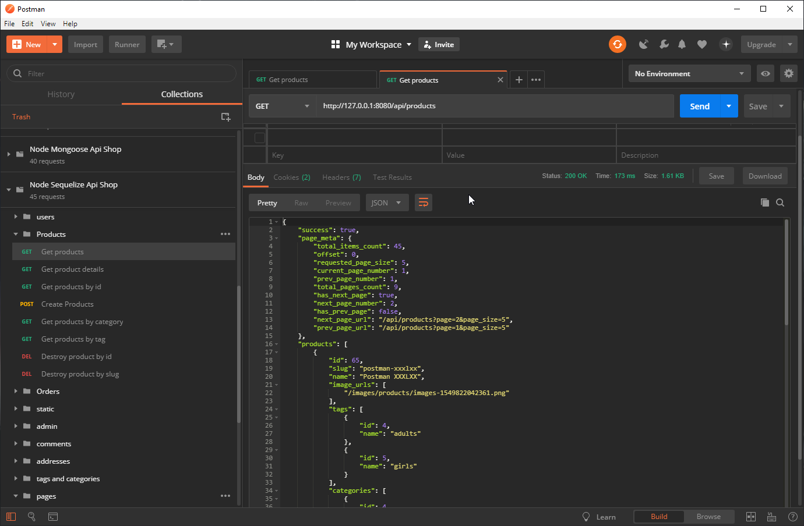
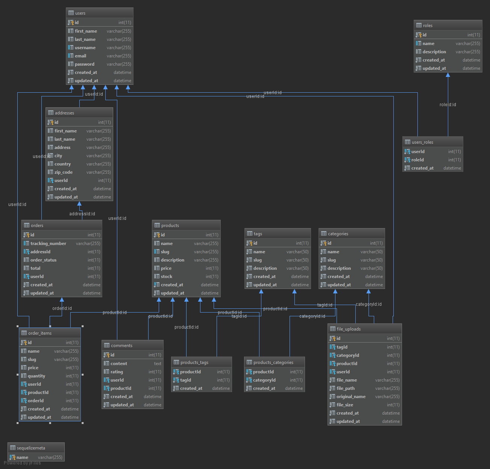

# Introduction
This is one of my E-commerce API app implementations. It is written in Node js, using Express and Sequelize ORM framework as the main dependencies.
This is not a finished project by any means, but it has a valid enough shape to be git cloned and studied if you are interested in this topic.
If you are interested in this project take a look at my other server API implementations I have made with:

- [Node Js + Bookshelf](https://github.com/melardev/ApiEcomBookshelfExpress)
- Node Js + Mongoose
- Django
- Flask
- [Java Spring Boot + Hibernate]() for the most part this is the implementation of reference.
- Golang go-gonic
- Ruby on Rails
- AspNet Core
- AspNet MVC
- Laravel

## WARNING
I have mass of projects to deal with so I make some copy/paste around, if something I say is missing or is wrong, then I apologize
and you may let me know opening an issue.

# Get started
1. Install dependencies
`npm install`
2. Rename the .env.example to .env and setup database, according to your needs
The database settings can be changed from the .env file, you can switch between sqlite and MySQL effortlessly by 
only changing the dialect and the username/password for your MySQL server if you are using MySQL.
I strongly encourage you to use MySQL because using SQLite you may run into " sqlite database locked" issues.
if you use sqlite(default) then:
`node_modules\.bin\sequelize db:migrate`
if mysql or other then:
`node_modules\.bin\sequelize db:drop && node_modules\.bin\sequelize db:create && node_modules\.bin\sequelize db:migrate`
3. Seed database
`node_modules\.bin\sequelize db:seed:all`
Please notice that regarding the seeding implementation I am not doing it the _sequelize_ way
because I do not use the sequelize param provided y the up function, instead I use mine.

4. The last step is up to you, you can either open it in an IDE and debug it, or you can open the api.postman_collection.json with Postman, and then execute the queries

# Features
- Authentication / Authorization
- Paging
- CRUD operations on products, comments, tags, categories

- Orders, guest users may place an order


# What you will learn
- Sequelize ORM
    - associations: hasMany, belongsTo, belongsToMany
    - scopes
    - virtuals
    - complex queries
    - paging
    - eager loading, select columns on related associations
    
- express
    - middlewares
    - authentication
    - authorization
- seed data with faker js
- misc
    - project structure
    - dotenv
    
# Understanding the project
The project is meant to be educational, to learn something beyond the hello world thing we find in a lot, lot of 
tutorials and blog posts. Since its main goal is educational, I try to make as much use as features of APIs, in other
words, I used different code to do the same thing over and over, there is some repeated code but I tried to be as unique
as possible so you can learn different ways of achieving the same goal.
Project structure:
- models: Mvc, it is our domain data.
- dtos: it contains our serializers, they will create the response to be sent as json. They also take care of validating the input(feature incomplete)
- controllers: well this is the mvC, our business logic.
- routes: they register routes to router middleware
- middleware: some useful middleware, mainly the authentication and authorization middleware.
- config: the database configurer.
- seeders: contains the file that seeds the database.
- .env the env file from where to populate the process.env node js environment variable
- public: contains the uploaded files.

# Useful Sequelize CLI commands
Replace backslashes by forward slashes if you are in Linux or Mac

- Create database
`node_modules\.bin\sequelize db:create`
- Drop database
`node_modules\.bin\sequelize db:drop`
- Run migration files
`node_modules\.bin\sequelize db:migrate`

- Seed all
`node_modules\.bin\sequelize db:seed:all`
- Undo only last seed
`node_modules\.bin\sequelize db:seed:undo`
- Undo all
`node_modules\.bin\sequelize db:seed:undo:all`

- Drop, Create and migrate
`reset.bat`
- Drop And migrate
`drop_migrate.bat`

# Steps followed to create this project (incomplete)

```shell
npm install --save sequelize
# npm install --save sqlite3
npm install --save mysql2
# or
# yarn add sqlite3
# yarn add mysql2
npm install --save sequelize-cli
# Generate sequelize folders and config.json with:
./node_modules/.bin/sequelize init

# Populate config.json with connection settings
# then create the database with:
$ ./node_modules/.bin/sequelize db:create

# generate models and migration files
$ node_modules/.bin/sequelize model:generate --name User --attributes firstName:string,lastName:string,email:string

# write migration code

# migrate
$ node_modules/.bin/sequelize db:migrate

# generate seeds
$ .\node_modules\.bin\sequelize seed:generate --name seed-categories

# seed
$ node_modules/.bin/sequelize db:seed:all
```

# TODO
- Hook user pre create, save ROLE_USER
- Timestamped Model
- I have troubles setting column names with underscores(i.e userId), this is why I named the foreign key columns with camelcase(userId, orderId)
and not underscore, in the future I have to refactor to snake case instead
- Unit testing
- Improve README.md

# Resources
- [Sequelize](http://docs.sequelizejs.com/)
- [Sequelize Scopes](http://docs.sequelizejs.com/manual/tutorial/scopes.html)
- [Express](https://expressjs.com/)
- [Express-jwt](https://github.com/auth0/express-jwt)
- [jsonwebtoken](https://github.com/auth0/node-jsonwebtoken)
- [Required attribute](https://stackoverflow.com/questions/52063685/sequelize-eager-loading-associations-with-optional-scopes)
- [sanitize-html](https://www.npmjs.com/package/sanitize-html)
